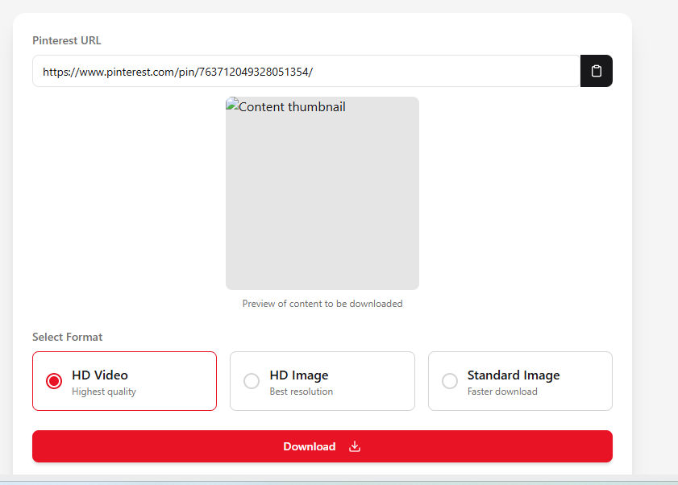

# Pinterest Media Downloader

A modern web application that allows users to download videos and images from Pinterest URLs.

## Features

- Download both Pinterest images and videos in high quality
- Sleek and responsive user interface with light/dark mode support
- Tab-based format selection between videos and images
- Detailed file information (size, resolution, duration)
- Automatic content type detection
- Download history with clear all option

## Tech Stack

- **Frontend:** React, TypeScript, Tailwind CSS, Framer Motion
- **Backend:** Node.js, Express
- **Data Extraction:** Axios, Cheerio
- **Validation:** Zod
- **State Management:** React Query

## Screenshots



## Getting Started

### Prerequisites

- Node.js (v14 or later)
- npm or yarn

### Installation

1. Clone the repository
```bash
git clone https://github.com/yourusername/pinterest-media-downloader.git
cd pinterest-media-downloader
```

2. Install dependencies
```bash
npm install
```

3. Start the development server
```bash
npm run dev
```

4. Open your browser and navigate to `http://localhost:5000`

## Usage

1. Paste a Pinterest URL in the input field (e.g., https://pinterest.com/pin/123456789/)
2. Click the "Search" button to fetch the content
3. Select your preferred format (HD Video, HD Image, or Standard Image)
4. Click the "Download" button to save the file to your device

## Deployment on Vercel

This application can be deployed to Vercel by following these steps:

1. Make sure you have the `vercel.json` file in your project root (it should be included already)

2. Create a Vercel account if you don't have one
   - Go to [vercel.com](https://vercel.com) and sign up using GitHub, GitLab, or your email

3. Install Vercel CLI (optional)
   ```bash
   npm install -g vercel
   ```

4. Deploy from your repository
   - Connect your GitHub/GitLab account to Vercel
   - Import your repository
   - Set the following deployment settings:
     - Build Command: `npm run build`
     - Output Directory: `dist`
     - Install Command: `npm install`

5. Or deploy from your local machine using Vercel CLI
   ```bash
   vercel
   ```

6. After deployment, your app will be available at a URL provided by Vercel

### Troubleshooting Vercel Deployment

If you see raw HTML or code instead of your app after deployment:

1. Make sure the `vercel.json` file is properly configured (check that it exists in your project root)
2. Verify that your build script in package.json is correct
3. Ensure that the "Output Directory" in Vercel project settings is set to `dist`
4. Check Vercel deployment logs for any errors

## Contributing

Contributions are welcome! Please feel free to submit a Pull Request.

## License

This project is licensed under the MIT License - see the LICENSE file for details.